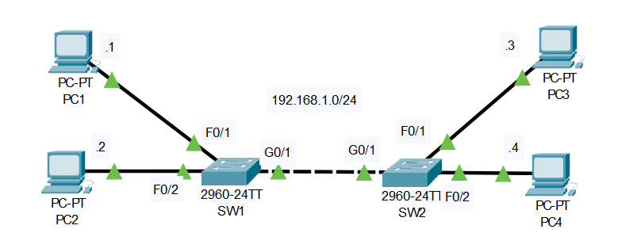

# Intro to NMAP

## Uses

* Host Discovery
* Port Scanning
* Service Enumeration
* OS Detection
* Scriptable interaction with the target service (Nmap Scripting Engine)

## Basic Synatax

``` bash
nmap <scan types> <options> <target>
```

## Help

``` bash
nmap --help
```

## TCP-SYN scan (-sS)

For example, the TCP-SYN scan (-sS) is one of the default settings unless we have defined otherwise and is also one of the most popular scan methods. This scan method makes it possible to scan several thousand ports per second. The TCP-SYN scan sends one packet with the SYN flag and, therefore, never completes the three-way handshake, which results in not establishing a full TCP connection to the scanned port.

* If our target sends a SYN-ACK flagged packet back to us, Nmap detects that the port is open.
* If the target responds with an RST flagged packet, it is an indicator that the port is closed.
* If Nmap does not receive a packet back, it will display it as filtered. Depending on the firewall configuration, certain packets may be dropped or ignored by the firewall.


[Download Day 06 Lab - Ethernet LAN Switching](../assets/common-assets/Day%2006%20Lab%20-%20Ethernet%20LAN%20Switching.pkt){:download="Day 06 Lab - Ethernet LAN Switching.pkt"}

### Topology

<figure markdown>
  { width="800" }
  <figcaption></figcaption>
</figure>

### Questions

Both switches have an empty MAC address table, and all PCs have an empty ARP table.

1.  If PC1 pings to PC3, what messages will be sent over the network, and which devices will receive them?
2.  Send the ping and use Packet Tracer's 'simulation mode' to verify your answer.
3.  Use pings to generate network traffic and allow the switches to learn the MAC addresses of all PCs on the network.
4.  Use 'show' commands on the switches to identify the MAC address of each PC.
5.  Clear the dynamic MAC addresses from the MAC address table of each switch.

## Answers

??? "Confirm PC ARP Table and Switch MAC address tables"

    === "PC1"
        
        Show ARP table
        ```` bash
        arp -a
        ````

        Results
        ``` bash
        C:\>arp -a
        No ARP Entries Found
        ```

    === "Switch #1"

        Show MAC table
        ```` bash
        show mac-address-table
        ````

        Results
        ``` bash
        SW1>en
        SW1#show mac-address-table
                Mac Address Table
        -------------------------------------------

        Vlan    Mac Address       Type        Ports
        ----    -----------       --------    -----

        SW1#
        ```


    === "Switch #2"

        Show MAC table
        ```` bash
        show mac-address-table
        ````

        Results
        ``` bash
        SW2>en
        SW2#show mac-address-table
                Mac Address Table
        -------------------------------------------

        Vlan    Mac Address       Type        Ports
        ----    -----------       --------    -----

        SW2#
        ```      

??? "Use 'show' commands on the switches to identify the MAC address of each PC."

    === "Switch #1"

        Results
        ``` bash
        SW1#show mac-address-table 
                Mac Address Table
        -------------------------------------------

        Vlan    Mac Address       Type        Ports
        ----    -----------       --------    -----

        1    0001.647b.3119    DYNAMIC     Gig0/1
        1    0004.9a6e.d870    DYNAMIC     Gig0/1
        1    0060.5c56.14d3    DYNAMIC     Fa0/2
        1    00d0.d3ad.9cab    DYNAMIC     Fa0/1
        SW1#
        ```


    === "Switch #2"

        Results
        ``` bash
        SW2#show mac-address-table 
                Mac Address Table
        -------------------------------------------

        Vlan    Mac Address       Type        Ports
        ----    -----------       --------    -----

        1    0001.647b.3119    DYNAMIC     Fa0/2
        1    0004.9a6e.d870    DYNAMIC     Fa0/1
        1    0060.5c56.14d3    DYNAMIC     Gig0/1
        1    00d0.d3ad.9cab    DYNAMIC     Gig0/1 
        SW2#
        ``` 

??? "Clear the dynamic MAC addresses from the MAC address table of each switch."

    Clear Dynamic MAC table
    ``` bash
    SW1#clear mac-address-table dynamic
    ```

## Commands

* `arp -a` - Display PC ARP table
* `show mac-address-table ` - Show Switch MAC address tables
* `clear mac-address-table dynamic` - Clear Dynamic MAC addresses from switch
