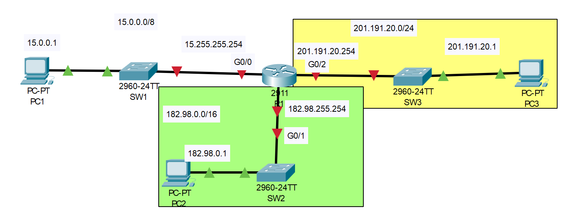

# IPv4 Addresses

## Introduction

### Packet Tracer

[Download Day 08 Lab - IPv4 Addresses](../assets/common-assets/Day%2008%20Lab%20-%20IPv4%20Addresses.pkt){:download="Day 08 Lab - IPv4 Addresses.pkt"}
### Topology

<figure markdown>
  { width="800" }
  <figcaption></figcaption>
</figure>

### Questions

1. Configure R1's hostname
2. Use a 'show' command to view a list of R1's interfaces, their IP addresses, status, etc.
3. Configure the appropriate IP addresses on R1's interfaces, and enable the interfacesConfigure appropriate interface descriptions
4. Use a 'show' command to verify R1's interfaces again.
5. View the running config to confirm the configuration changes, then save the config
6. Configure the IP addresses of PC1, PC2, and PC3
7. Ping from PC1 to PC2 and PC3 to test connectivity

## Answers

??? "1. Confirm R1's hostname"

    ``` bash
    Router>en
    Router#conf t
    Enter configuration commands, one per line.  End with CNTL/Z.
    Router(config)#hostname R1
    R1(config)#
    ``` 

??? "2. Use a 'show' command to view a list of R1's interfaces, their IP addresses, status, etc."

    ``` bash
    R1#show ip int bri
    Interface              IP-Address      OK? Method Status                Protocol 
    GigabitEthernet0/0     unassigned      YES unset  administratively down down 
    GigabitEthernet0/1     unassigned      YES unset  administratively down down 
    GigabitEthernet0/2     unassigned      YES unset  administratively down down 
    Vlan1                  unassigned      YES unset  administratively down down
    R1#
    ```
    Note: "Status" column indicates the Layer 1 status. Currently this is down because CISCO routers 
    have the 'shutdown' command applied to them by default

    Note: "Protocol" column indicates the Layer 2 status. Because Layer 1 is down, Layer 2 can't operate, so they are all down.

??? "3. Configure the appropriate IP addresses on R1's interfaces, and enable the interfaces. Configure appropriate interface descriptions"

    === "GigabitEthernet0/0"
        
        Configure R1's Gi0/0 interface
        ``` bash
        R1(config)#int g0/0
        R1(config-if)#ip address 15.255.255.254 255.0.0.0
        R1(config-if)#description ## to SW1 ##
        R1(config-if)#no shutdown

        R1(config-if)#
        %LINK-5-CHANGED: Interface GigabitEthernet0/0, changed state to up

        %LINEPROTO-5-UPDOWN: Line protocol on Interface GigabitEthernet0/0, changed state to up
        ```

    === "GigabitEthernet0/1"
        
        Configure R1's Gi0/1 interface
        ``` bash
        R1(config-if)#int g0/1
        R1(config-if)#ip address 182.98.255.254 255.255.0.0
        R1(config-if)#description ## to SW2 ##
        R1(config-if)#no shut

        R1(config-if)#
        %LINK-5-CHANGED: Interface GigabitEthernet0/1, changed state to up

        %LINEPROTO-5-UPDOWN: Line protocol on Interface GigabitEthernet0/1, changed state to up
        ```

    === "GigabitEthernet0/1"
        
        Configure R1's Gi0/2 interface
        ``` bash
        R1(config-if)#int g0/2
        R1(config-if)#ip add
        R1(config-if)#ip add 201.191.20.254 255.255.255.0
        R1(config-if)#desc ## to SW3 ##
        R1(config-if)#no shut

        R1(config-if)#
        %LINK-5-CHANGED: Interface GigabitEthernet0/2, changed state to up

        %LINEPROTO-5-UPDOWN: Line protocol on Interface GigabitEthernet0/2, changed state to up
        ```

??? "4. Use a 'show' command to verify R1's interfaces again."

    ``` bash
    R1(config-if)#do show ip int bri
    Interface              IP-Address      OK? Method Status                Protocol 
    GigabitEthernet0/0     15.255.255.254  YES manual up                    up 
    GigabitEthernet0/1     182.98.255.254  YES manual up                    up 
    GigabitEthernet0/2     201.191.20.254  YES manual up                    up 
    Vlan1                  unassigned      YES unset  administratively down down
    R1(config-if)#
    ```

??? "5. View the running config to confirm the configuration changes, then save the config"

    === "Show Running Config" 
        ``` bash
        R1#show running-config
        Building configuration...

        Current configuration : 818 bytes
        !
        version 15.1
        no service timestamps log datetime msec
        no service timestamps debug datetime msec
        no service password-encryption
        !
        hostname R1
        !
        !
        !
        !
        !
        !
        !
        !
        ip cef
        no ipv6 cef
        !
        !
        !
        !
        license udi pid CISCO2911/K9 sn FTX1524NMDP-
        !
        !
        !
        !
        !
        !
        !
        !
        !
        !
        !
        spanning-tree mode pvst
        !
        !
        !
        !
        !
        !
        interface GigabitEthernet0/0
        description ## to SW1 ##
        ip address 15.255.255.254 255.0.0.0
        duplex auto
        speed auto
        !
        interface GigabitEthernet0/1
        description ## to SW2 ##
        ip address 182.98.255.254 255.255.0.0
        duplex auto
        speed auto
        !
        interface GigabitEthernet0/2
        description ## to SW3 ##
        ip address 201.191.20.254 255.255.255.0
        duplex auto
        speed auto
        !
        interface Vlan1
        no ip address
        shutdown
        !
        ip classless
        !
        ip flow-export version 9
        !
        !
        !
        no cdp run
        !
        !
        !
        !
        !
        line con 0
        !
        line aux 0
        !
        line vty 0 4
        login
        !
        !
        !
        end


        R1#
        ```

    === "Save the Config" 

        Copy the running config into the startup config
        ``` bash
        R1#copy running-config startup-config 
        Destination filename [startup-config]? 
        Building configuration...
        [OK]
        R1#
        ```

        ...or use the shortcut 'write'
        ``` bash
        R1#wr
        Building configuration...
        [OK]
        R1#
        ```

## Commands

* `hostname <hostname>` - Change the hostname of the device
* `show ip interface brief` - Display a list of interfaces (router only)
* `show running-config` - display running config
* `copy running-config startup-config` - save the configuration