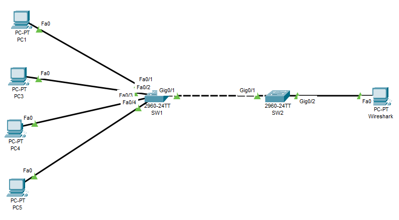

# SPAN and RSPAN

Remote SPAN enables the source and destination ports to be configured on separate switches. The duplicated network traffic is placed on the RSPAN VLAN, which is solely for SPAN traffic. The RSPAN VLAN is trunked between switches, allowing the RSPAN session traffic to traverse multiple switches. A switch with Remote SPAN VLAN works differently than a regular switch, wherein:

- The switch won’t attempt to use the port linked to the RSPAN VLAN to transfer data to the end host since MAC addresses aren’t learned on these ports. Therefore, the normal forwarding path is retained.
- All RSPAN VLAN ports are flooded with traffic. It should be associated with trunk ports between the source switch and the destination switch.

RSPAN sessions capture traffic similarly to local SPAN sessions. However, more traffic goes through the trunk link, potentially starving normal network traffic. In addition, STP will also run on the trunk link, so the STP BPDUs will not be filtered because it would establish a forwarding loop.

## Commands Used

* `monitor session 1 destination remote vlan 50`
* `show monitor session remote`

    <figure markdown>
        { width="800" }
        <figcaption></figcaption>
    </figure>

## Configurations

??? Note "RPSAN Configuration"

    In this example, using the topology above, the traffic from Switch1’s Fast 0/1-4 interfaces will be forwarded to Gig0/2 on Switch2.

    First, a VLAN is created and then designated as an RSPAN VLAN using the ‘remote-span’ command. The RSPAN session VLAN must be the same on all switches.

    === "SW1"

        ``` bash
        SW1(config)#vlan 50
        SW1(config-vlan)#remote-span
        ```

    === "SW2"

        ``` bash
        SW2(config)#vlan 50
        SW2(config-vlan)#remote-span
        ```

    Next, configure the ports between the two switches as trunk ports.

    === "SW1"

        ``` bash
        SW1(config)#interface g0/1
        SW1(config-if)#switchport trunk encapsulation dot1q
        SW1(config-if)#switchport mode trunk
        ```

    === "SW2"

        ``` bash
        SW2(config)#interface g0/1
        SW2(config-if)#switchport trunk encapsulation dot1q
        SW2(config-if)#switchport mode trunk
        ```

    Next, configure the source switch, SW1. Interface f0/1-4 will be the source port, and VLAN 50 will be the destination. On SW2, VLAN 50 will be the source, and the SPAN port Gi0/1 will be the destination port.
    
    === "SW1"

        ``` bash
        SW1(config)#monitor session 1 source int f0/1 - 4
        SW1(config)#monitor session 1 destination remote vlan 50
        ```   
    === "SW2"

        ``` bash
        SW2(config)#monitor session 1 source remote vlan 50
        SW2(config)#monitor session 1 destination interface gig0/0/1
        ```  

    ??? abstract "Verify"

        === "SW1"

            ``` bash
            SW1#show monitor session remote

            Session 1
            ---------
            Type: Remote Source Session
            Source Ports :
            Both: gi0/1
            Dest RSPAN VLAN: 50
            ```

        === "SW2"

            ``` bash
            SW2#show monitor session 1

            Session 1
            ---------
            Type: Remote Destination Session
            Source RSPAN VLAN: 50
            Destination Ports: gi0/1
            Encapsulation: Native
            Ingress: Disabled
            ```