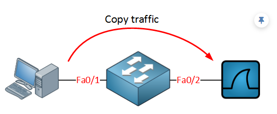

# SPAN and RSPAN

When you use a destination interface on the same switch as your switch we call it SPAN, when the destination is a remote interface on another switch we call it RSPAN (Remote SPAN).  When using RSPAN, you need to use a VLAN for your RSPAN traffic so that traffic can travel from the source switch to the destination switch.

## Commands Used

* `monitor session 1 source int fast0/1 - 23`
* `monitor session 1 destination int g0/1`
* `show monitor session 1`
* `monitor session 1 source interface fa0/1 tx`
* `monitor session 1 source interface fa0/1 rx`
* `monitor session 1 filter vlan 1 - 100`
* `monitor session 1 source vlan 1`


    <figure markdown>
        { width="800" }
        <figcaption></figcaption>
    </figure>

## Configurations

??? Note "SPAN Configuration"

    ``` bash
    SW1#configure terminal
    SW1(config)#monitor session 1 source int fast0/1 - 23
    SW1(config)#monitor session 1 destination int g0/1
    ```

    ??? abstract "Verify"

        ``` bash
        SW1(config)#do show monitor session 1
        Session 1
        ---------
        Type                   : Local Session
        Description            : -
        Source Ports           : 
            Both               : Fa0/1,Fa0/2,Fa0/3,Fa0/4,Fa0/5,Fa0/6,Fa0/7,Fa0/8,Fa0/9,Fa0/10,Fa0/11,Fa0/12,Fa0/13,Fa0/14,Fa0/15,Fa0/16,Fa0/17,Fa0/18,Fa0/19,Fa0/20,Fa0/21,Fa0/22,Fa0/23
        Destination Ports      : Gig0/1
            Encapsulation      : Native
                Ingress      : Disabled


        SW1(config)#
        ```

??? Note "Capture only Transmit or Recieved Data"

    ``` bash
    SW1#configure terminal
    SW1(config)#monitor session 1 source interface fa0/1 ?
        ,     Specify another range of interfaces
        -     Specify a range of interfaces
        both  Monitor received and transmitted traffic
        rx    Monitor received traffic only
        tx    Monitor transmitted traffic only
    ```

??? Note "By VLAN"

    If interface Gi0/1 were a trunk, you could add a filter to select the VLANs you want to forward. Below will only forware VLAN 1 - 100 to the destination.

    ``` bash
    SW1(config)#monitor session 1 filter vlan 1 - 100
    ```

    You could also use a VLAN as a source

    ``` bash
    SW1(config)#monitor session 1 source vlan 1
    ```