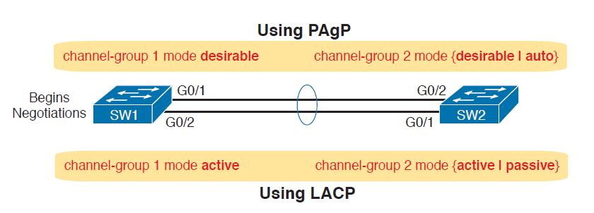

# Securing the device CLI

## Commands Used

* `channel-group 1 mode active`
* `show etherchannel summary`

    <figure markdown>
        { width="800" }
        <figcaption></figcaption>
    </figure>

## Configurations

??? Note "Configuring a Layer 2 EtherChannel with LACP"

    <figure markdown>
        { width="800" }
        <figcaption></figcaption>
    </figure>

    === "SW1"

        ``` bash
        SW1#configure terminal
        Enter configuration commands, one per line.  End with CNTL/Z.

        SW1(config)#int range g0/1-2
        SW1(config-if-range)#channel-group 1 mode active

        SW1(config-if-range)#int po1
        SW1(config-if)#switchport mode trunk
        ```

        ??? abstract "Verify"

            ``` bash
            SW1#show etherchannel summary
            Flags:  D - down        P - in port-channel
                    I - stand-alone s - suspended
                    H - Hot-standby (LACP only)
                    R - Layer3      S - Layer2
                    U - in use      f - failed to allocate aggregator
                    u - unsuitable for bundling
                    w - waiting to be aggregated
                    d - default port


            Number of channel-groups in use: 1
            Number of aggregators:           1

            Group  Port-channel  Protocol    Ports
            ------+-------------+-----------+----------------------------------------------

            1      Po1(SU)           LACP   Gig0/1(P) Gig0/2(P) 
            SW1#
            ```

    === "SW2"

        ``` bash
        SW2#configure terminal
        Enter configuration commands, one per line.  End with CNTL/Z.

        SW2(config)#int range g0/1-2
        SW2(config-if-range)#channel-group 1 mode active

        SW2(config-if-range)#int po1
        SW2(config-if)#switchport mode trunk        
        ```

        ??? abstract "Verify"

            ``` bash
            SW2#show etherchannel summary
            Flags:  D - down        P - in port-channel
                    I - stand-alone s - suspended
                    H - Hot-standby (LACP only)
                    R - Layer3      S - Layer2
                    U - in use      f - failed to allocate aggregator
                    u - unsuitable for bundling
                    w - waiting to be aggregated
                    d - default port


            Number of channel-groups in use: 1
            Number of aggregators:           1

            Group  Port-channel  Protocol    Ports
            ------+-------------+-----------+----------------------------------------------

            1      Po1(SU)           LACP   Gig0/1(P) Gig0/2(P) 
            SW2#
            ```

??? Note "Configuring a Layer 3 EtherChannel with static EtherChannel"

    <figure markdown>
        { width="800" }
        <figcaption></figcaption>
    </figure>

    === "DSW1"

        ``` bash
        DSW1#configure terminal 
        Enter configuration commands, one per line.  End with CNTL/Z.

        DSW1(config)#int range g0/1-2
        DSW1(config-if-range)#no switchport
        DSW1(config-if-range)#channel-group 4 mode on

        DSW1(config-if-range)# int po4
        DSW1(config-if)#ip add 10.0.0.1 255.255.255.252
        ```

        ??? abstract "Verify"

            ``` bash
            DSW1#show etherchannel summary 
            Flags:  D - down        P - in port-channel
                    I - stand-alone s - suspended
                    H - Hot-standby (LACP only)
                    R - Layer3      S - Layer2
                    U - in use      f - failed to allocate aggregator
                    u - unsuitable for bundling
                    w - waiting to be aggregated
                    d - default port


            Number of channel-groups in use: 1
            Number of aggregators:           1

            Group  Port-channel  Protocol    Ports
            ------+-------------+-----------+----------------------------------------------

            4      Po4(RU)           -      Gig0/1(P) Gig0/2(P) 
            DSW1#
            ```

    === "DSW2"

        ``` bash
        DSW2#configure terminal 
        Enter configuration commands, one per line.  End with CNTL/Z.

        DSW2(config)#int range g0/1-2
        DSW2(config-if-range)#no switchport
        DSW2(config-if-range)#channel-group 3 mode on

        DSW2(config-if-range)#int po3
        DSW2(config-if)#ip add 10.0.0.2 255.255.255.252
        ```

        ??? abstract "Verify"

            ``` bash
            DSW2#show etherchannel summary 
            Flags:  D - down        P - in port-channel
                    I - stand-alone s - suspended
                    H - Hot-standby (LACP only)
                    R - Layer3      S - Layer2
                    U - in use      f - failed to allocate aggregator
                    u - unsuitable for bundling
                    w - waiting to be aggregated
                    d - default port


            Number of channel-groups in use: 1
            Number of aggregators:           1

            Group  Port-channel  Protocol    Ports
            ------+-------------+-----------+----------------------------------------------

            3      Po3(RU)           -      Gig0/1(P) Gig0/2(P) 
            DSW2#
            ```  