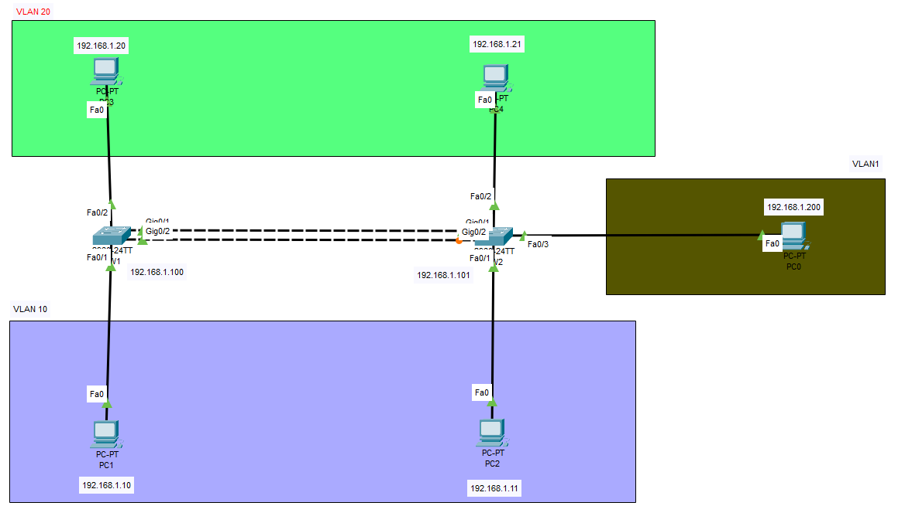

# VLAN Trunk over an EtherChannel

## Commands Used

* Verify
    * `show interfaces trunk`
    * `show vlan brief `
    * `show etherchannel summary `

## Configurations

??? Note "Configuring an EtherChannel as a VLAN Trunk"

    Honestly, this is pretty much the same thing as the EtherChannel guide. An EtherChannel will most likely always be a trunk.

    <figure markdown>
        { width="800" }
        <figcaption></figcaption>
    </figure>

    === "SW1"

        ``` bash
        SW1#configure terminal 
        Enter configuration commands, one per line.  End with CNTL/Z.

        SW1(config)#int f0/1
        SW1(config-if)#switchport access vlan 10
        SW1(config-if)#int f0/2
        SW1(config-if)#switchport access vlan 20

        ! This may be a bug, but I've had more success with first shutting down the interfaces before adding them to the etherchannel
        SW1(config-if)#int range g0/1-2
        SW1(config-if-range)#shut

        SW1(config-if)#int range g0/1-2
        SW1(config-if-range)#channel-group 1 mode on

        SW1(config-if-range)#int port-channel 1
        SW1(config-if)#switchport mode trunk
        SW1(config-if)#end

        SW1(config)#int range g0/1-2
        SW1(config-if-range)#no shut
        ```

    === "SW2"

        ``` bash
        SW2#configure terminal 
        Enter configuration commands, one per line.  End with CNTL/Z.

        SW2(config)#int f0/1
        SW2(config-if)#switchport access vlan 10
        SW2(config-if)#int f0/2
        SW2(config-if)#switchport access vlan 20

        ! This may be a bug, but I've had more success with first shutting down the interfaces before adding them to the etherchannel
        SW2(config-if)#int range g0/1-2
        SW2(config-if-range)#shut

        SW2(config-if)#int range g0/1-2
        SW2(config-if-range)#channel-group 1 mode on

        SW2(config-if-range)#int port-channel 1
        SW2(config-if)#switchport mode trunk
        SW2(config-if)#end

        SW2(config)#int range g0/1-2
        SW2(config-if-range)#no shut     
        ```