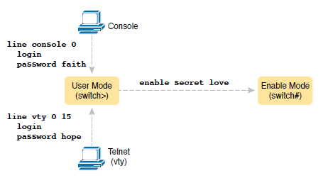

# Securing the device CLI

## Commands Used

* Passwords
    * `enable password myPass` - Sets the enable password to myPass
    * `enable secret myPass` - Sets the encrypted enable password to myPass
    * `username david password pa$$word` - Sets a username/password pair

* SSH Configuration
    * `ip domain-name example.com` - Sets the encrypted enable password to myPass
    * `crypto key generate rsa` - Sets the encrypted enable password to myPass
    * `ip ssh version 2` - Sets the encrypted enable password to myPass

* AAA Authentication
    * `aaa new-model`
    * `aaa authentication login default group tacacs+ local`
    * `tacacs-server host 192.168.1.100 key xyz` - IP address of the AAA server and shared key

## Configurations

??? Note "Securing User Mode and Privileged Mode with Simple Passwords"

    This configuration uses simple shared passwords and no username. This will allow users to access the switch in either console mode or telnet.

    <figure markdown>
        { width="800" }
        <figcaption></figcaption>
    </figure>

    ``` bash
    SW1#configure terminal
    SW1(config)#enable password myPass
    ! You could also use "enable secret myPass" so only an encrypted version of the password appears in the running config.

    ! Console users will use "consolePass" to login
    SW1(config)#line console 0
    SW1(config-line)#password consolePass
    SW1(config-line)#login
    SW1(config-line)#exit

    ! Telnet users will use "vtyPass" to login
    SW1(config)#line vty 0 15
    SW1(config-line)#password vtyPass
    SW1(config-line)#login
    SW1(config-line)#exit
    SW1(config)#

    ! The final step to allow remote (Telnet) access is to provide an IP address to the vlan you will be using
    SW1(config)#interface vlan 1
    SW1(config-if)#ip address 192.168.1.2 255.255.255.0
    SW1(config-if)#no shut
    ```

??? Note "Securing User Mode Access with Local Usernames and Passwords"

    Using local username/password pairs replaces the shared passwords for console and remote access but does not replace the enable password.

    <figure markdown>
        { width="800" }
        <figcaption></figcaption>
    </figure>

    ``` bash
    SW1#configure terminal
    SW1(config)#enable secret myPass
    SW1(config)#username David password davidPass
    SW1(config)#username KyloRen secret kyloPass

    ! "no password" is optional but is good housekeeping and deletes any simple shared passwords
    SW1(config)#line console 0
    SW1(config-line)#login local
    SW1(config-line)#no password

    SW1(config-line)#line vty 0 15
    SW1(config-line)#login local
    SW1(config-line)#no password

    SW1(config)#interface vlan 1
    SW1(config-if)#ip address 192.168.1.2 255.255.255.0
    SW1(config-if)#no shut
    ```

??? Note "Securing Remote Access with Secure Shell (SSH)"

    This will use local username/passwords pairs for console and remote access but only allows SSH for remote access

    ``` bash
    SW1#configure terminal
    SW1(config)#enable secret myPass
    SW1(config)#username David password davidPass
    SW1(config)#username KyloRen secret kyloPass

    SW1(config)#ip domain-name example.com
    SW1(config)#crypto key generate rsa
    How many bits in the modulus [512]: 1024
    SW1(config)#ip ssh version 2

    SW1(config)#line console 0
    SW1(config-line)#login local
    SW1(config-line)#no password

    SW1(config-line)#line vty 0 15
    SW1(config-line)#login local
    SW1(config-line)#no password
    SW1(config-line)#transport input ssh
    SW1(config-line)#end

    SW1(config)#interface vlan 1
    SW1(config-if)#ip address 192.168.1.2 255.255.255.0
    SW1(config-if)#no shut
    ```

??? Note "Securing User Mode Access with External Authentication Servers"

    As long as the switch can communicate to the AAA server, then it will use the username/password pairs stored there. If not, then it will use the locally configured username/password (root/pass in this case)

    <figure markdown>
        { width="800" }
        <figcaption></figcaption>
    </figure>    

    ``` bash
    SW1#configure terminal
    SW1(config)#enable password myPass   
    SW1(config)#username root password pass

    SW1(config)#ip domain-name example.com
    SW1(config)#crypto key generate rsa
    How many bits in the modulus [512]: 2048
    SW1(config)#ip ssh version 2    

    SW1(config)#aaa new-model
    SW1(config)#aaa authentication login default group tacacs+ local
    SW1(config)#tacacs-server host 192.168.1.100 key xyz

    SW1(config)#line console 0
    SW1(config-line)#login authentication default
    SW1(config-line)#no password

    SW1(config-line)#line vty 0 15
    SW1(config-line)#login authentication default
    SW1(config-line)#no password
    SW1(config-line)#transport input ssh

    SW1(config)#interface vlan 1
    SW1(config-if)#ip address 192.168.1.200 255.255.255.0
    SW1(config-if)#no shutdown    
    ```


  