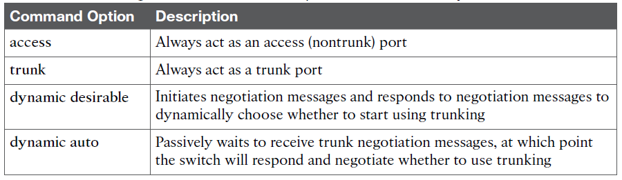
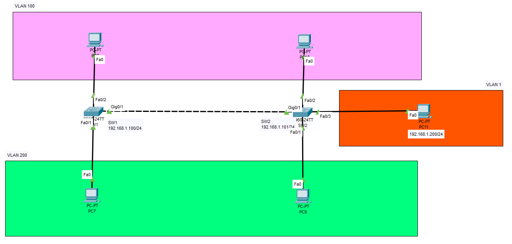

# VLAN Trunking

## Commands Used

* Assinging a port to an access VLAN
    * `int f0/1`
    * `switchport access vlan 200`
    * `switchport mode access`

* Assinging a port to an trunk VLAN
    * `int g0/1`
    * `switchport mode trunk` - or "dynamic desirable" or "dynamic auto"

    <figure markdown>
        { width="800" }
        <figcaption></figcaption>
    </figure>


## Configurations

??? Note "VLAN Trunking Configuration"

    <figure markdown>
        { width="800" }
        <figcaption></figcaption>
    </figure>

    === "SW1"

        ``` bash
        Switch#configure terminal
        Enter configuration commands, one per line.  End with CNTL/Z.

        ! configuring vlan 1 so we can use it for administration
        Switch(config)#hostname SW1
        SW1(config)#int vlan 1
        SW1(config-if)#ip address 192.168.1.100 255.255.255.0
        SW1(config-if)#no shut
        SW1(config-if)#exit

        ! Creating VLAN 100 and VLAN 200
        SW1(config)#vlan 100
        SW1(config-vlan)#name PLC-vlan
        SW1(config-vlan)#exit

        SW1(config)#vlan 200
        SW1(config-vlan)#name HMI-vlan
        SW1(config-vlan)#exit

        ! Assigning access ports
        SW1(config)#int f0/1
        SW1(config-if)#switchport access vlan 200
        SW1(config-if)#switchport mode access

        SW1(config-if)#int f0/2
        SW1(config-if)#switchport access vlan 100
        SW1(config-if)#switchport mode access
        SW1(config-if)#end

        ! Assiging trunk port
        SW1(config)#int g0/1
        SW1(config-if)#switchport mode trunk
        SW1(config-if)#end
        ```

    === "SW2"

        ``` bash
        Switch#configure terminal
        Enter configuration commands, one per line.  End with CNTL/Z.

        ! configuring vlan 1 so we can use it for administration
        Switch(config)#hostname SW2
        SW2(config)#int vlan 1
        SW2(config-if)#ip address 192.168.1.101 255.255.255.0
        SW2(config-if)#no shut
        SW2(config-if)#exit

        ! Creating VLAN 100 and VLAN 200
        SW2(config)#vlan 100
        SW2(config-vlan)#name PLC-vlan
        SW2(config-vlan)#exit

        SW2(config)#vlan 200
        SW2(config-vlan)#name HMI-vlan
        SW2(config-vlan)#exit

        ! Assigning access ports
        SW2(config)#int f0/1
        SW2(config-if)#switchport access vlan 200
        SW2(config-if)#switchport mode access

        SW2(config-if)#int f0/2
        SW2(config-if)#switchport access vlan 100
        SW2(config-if)#switchport mode access
        SW2(config-if)#end

        ! Assiging trunk port
        SW2(config)#int g0/1
        SW2(config-if)#switchport mode trunk
        SW2(config-if)#end
        ```

    ??? abstract "Verify"

        ``` bash
        SW1#show interfaces trunk
        Port        Mode         Encapsulation  Status        Native vlan
        Gig0/1      on           802.1q         trunking      1

        Port        Vlans allowed on trunk
        Gig0/1      1-1005

        Port        Vlans allowed and active in management domain
        Gig0/1      1,100,200

        Port        Vlans in spanning tree forwarding state and not pruned
        Gig0/1      1,100,200

        SW1#
        ```