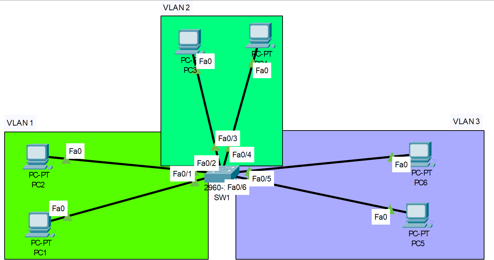

# Implementing VLANs

## Configurations

??? Note "Configuring Static IP Address"

    Switches need the same IP information that PCs do. This will set the IP Address, Subnet, and default-gateway (optional)

    ``` bash
    SW1#configure terminal
    SW1(config)#interface vlan 1
    SW1(config-if)#ip address 192.168.1.200 255.255.255.0
    SW1(config-if)#no shut
    SW1(config-if)#exit

    SW1(config)#ip default-gateway 192.168.1.1
    ```

??? Note "VLAN Configuration"

    Note: We did not have to do anything with VLAN 1 because all interfaces are assigned to VLAN 1 by default.

    <figure markdown>
        { width="800" }
        <figcaption></figcaption>
    </figure>

    ``` bash
    SW1#configure terminal
    Enter configuration commands, one per line.  End with CNTL/Z.

    ! Creating the VLAN
    SW1(config)#vlan 2
    SW1(config-vlan)#name HMI-vlan
    SW1(config-vlan)#exit

    ! Assigning the interfaces to a VLAN
    SW1(config)#interface range f0/3-4
    SW1(config-if-range)#switchport access vlan 2
    SW1(config-if-range)#switchport mode access
    SW1(config-if-range)#end

    ! Shorter VLAN configuration
    SW1(config)#int range f0/5-6
    SW1(config-if-range)#switchport access vlan 3
    % Access VLAN does not exist. Creating vlan 3
    ```

    ??? abstract "Verify"

        ``` bash
        SW1#show vlan bri

        VLAN Name                             Status    Ports
        ---- -------------------------------- --------- -------------------------------
        1    default                          active    Fa0/1, Fa0/2, Fa0/7, Fa0/8
                                                        Fa0/9, Fa0/10, Fa0/11, Fa0/12
                                                        Fa0/13, Fa0/14, Fa0/15, Fa0/16
                                                        Fa0/17, Fa0/18, Fa0/19, Fa0/20
                                                        Fa0/21, Fa0/22, Fa0/23, Fa0/24
                                                        Gig0/1, Gig0/2
        2    HMI-vlan                         active    Fa0/3, Fa0/4
        3    VLAN0003                         active    Fa0/5, Fa0/6
        1002 fddi-default                     active    
        1003 token-ring-default               active    
        1004 fddinet-default                  active    
        1005 trnet-default                    active    
        SW1#
        ```